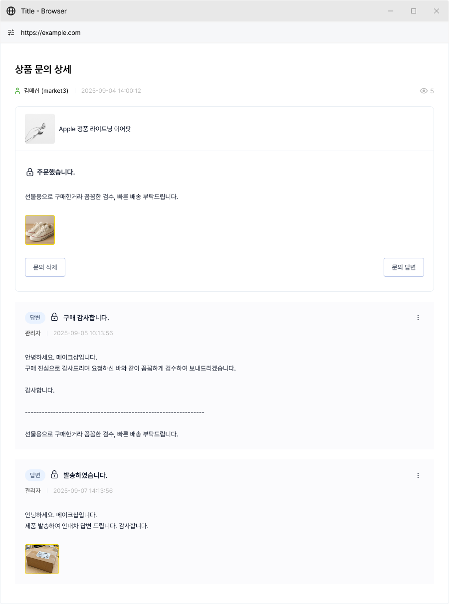

# 상품 리뷰

## 관리자 메뉴 위치

`문의·리뷰` > `상품 리뷰`

## 메뉴 안내 및 설정 방법

<figure><figcaption></figcaption></figure>

**① 리뷰 검색·필터**

* 상품명, 작성자, 평점, 노출 상태 등으로 리뷰를 검색할 수 있어요.

**② 리뷰 리스트**

* 구성: 상품 정보, 평점, 리뷰 내용, 작성자, 작성일, 노출 상태

**③ 리뷰 관리**

* 부적절한 리뷰는 `숨김` 처리할 수 있어요.
* 리뷰에 답글을 달아 고객과 소통할 수 있어요.


참고

리뷰 숨김은 삭제와 달리 다시 노출로 되돌릴 수 있어요. 신중하게 삭제해 주세요.

