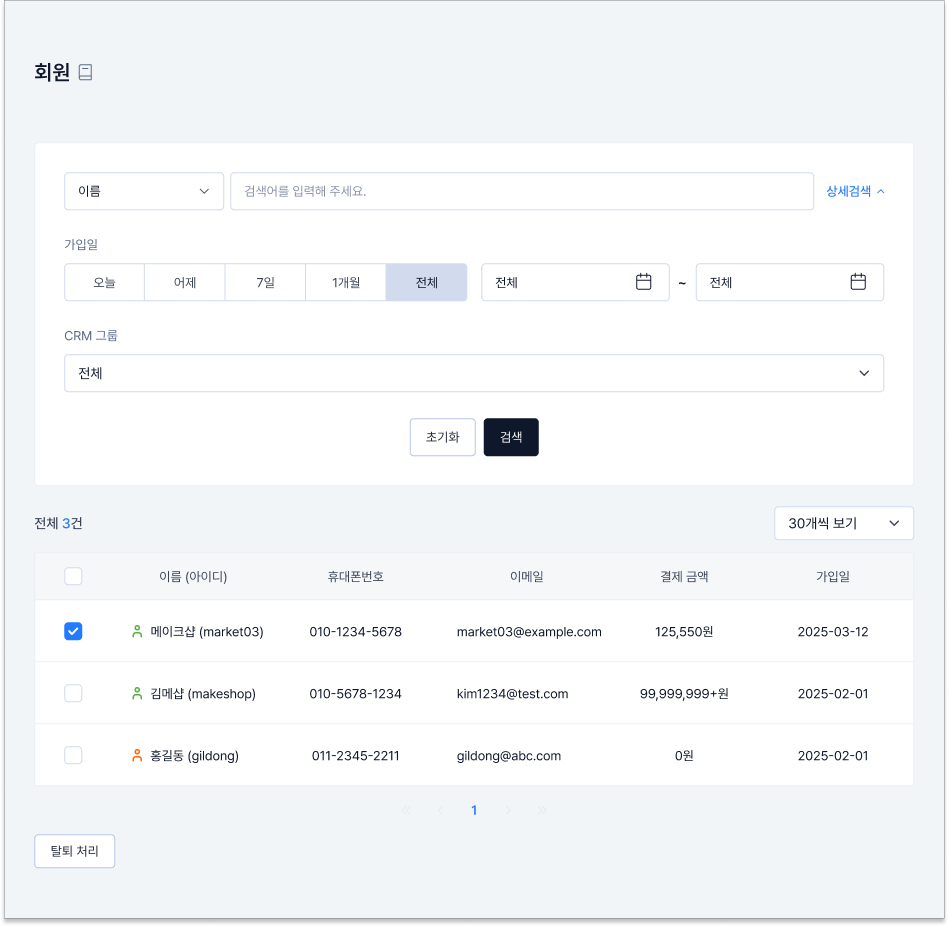

# 회원 목록

## 관리자 메뉴 위치

`회원` > `회원 목록`

## 메뉴 안내 및 설정 방법

<figure><figcaption></figcaption></figure>

**① 회원 검색**

* 검색 조건(이름 / 아이디 / 휴대폰번호 / 이메일)을 선택하고 검색어를 입력한 뒤 Enter를 누르세요.
* 입력한 값이 일부만 일치해도 결과에 표시돼요. (예: 휴대폰번호 `5678`로 검색하면 010-1234-5678 회원이 조회)
* 비워 두고 검색하면 전체 회원이 조회되고, `상세 검색`으로 여러 조건을 함께 지정할 수 있어요.

**② 검색 결과 건수 · 페이지당 개수**

* 조회된 회원 수가 표시돼요.
* 한 페이지에 보여줄 회원 수를 10 / 30 / 50 / 100명 중에서 선택하세요. (기본 30명, 설정 자동 저장)

**③ 회원 리스트**

* 기본 조회 기준은 전체 회원이며, 가입일 최신순으로 정렬돼요.
* 구성: 이름(아이디), 휴대폰번호, 이메일, 결제 금액, 가입일
* 이름 또는 아이디를 누르면 `회원 상세`로 이동해요.
* 이름 옆 CRM 등급 아이콘에 마우스를 올리면 등급명이 표시돼요. (최우수 · 우수 · 일반 · 주의 · 항의 고객)
* 결제 금액은 누적 결제 금액이며 환불·결제 실패 금액은 제외돼요. 8자리를 넘으면 `99,999,999+원`으로 표시돼요.

**④ 회원 탈퇴 처리**

* 탈퇴할 회원을 체크한 뒤 `탈퇴 처리` 버튼을 누르고 확인하세요.
* 회원을 선택하지 않고 누르면 안내 문구가 표시돼요.


참고

탈퇴 처리해도 해당 회원이 남긴 상품 문의와 리뷰는 삭제되지 않아요.

