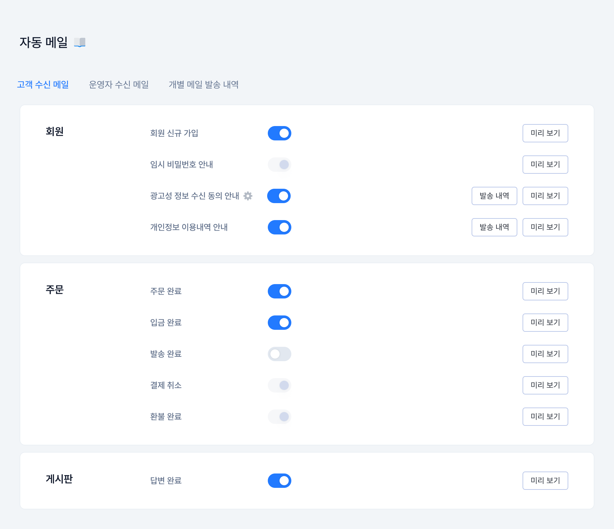

# 고객 수신 메일

## 관리자 메뉴 위치

`자동 메일`

## 메뉴 안내 및 설정 방법

<figure><figcaption></figcaption></figure>

**① 자동 메일 종류**

* 회원가입, 주문 완료, 배송 시작 등 상황별로 고객에게 자동 발송되는 메일이에요.

**② 발송 여부 설정**

* 각 상황별로 자동 메일을 보낼지(사용 / 사용 안 함)를 선택해요.


참고

발송되는 메일에는 쇼핑몰 이름·고객센터 정보가 함께 표시돼요. `설정 > 기본 정보`를 먼저 채워 두면 더 정확하게 안내돼요.

