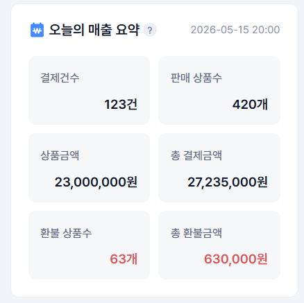

# 홈(대쉬보드)

## 관리자 메뉴 위치

`홈`

## 메뉴 안내 및 설정 방법

<figure><figcaption></figcaption></figure>

<figure><figcaption></figcaption></figure>

**① 현황 요약**

* 오늘의 주문, 매출, 방문자, 회원 수 등 쇼핑몰의 핵심 현황을 한눈에 볼 수 있어요.

<figure><figcaption></figcaption></figure>

**② 처리할 일**

* 새 주문, 배송 준비, 답변 대기 문의 등 지금 처리해야 할 항목으로 바로 이동할 수 있어요.

<figure><figcaption></figcaption></figure>

<figure><figcaption></figcaption></figure>

**③ 통계**

* 결제건수, 상품별 주문건수 등 통계정보가표시돼요.

**④ 공지·안내**

* 서비스 공지나 알아두면 좋은 안내가 표시돼요.


참고

대시보드의 각 요약 항목을 누르면 해당 상세 화면(주문 목록, 회원 목록 등)으로 이동해요.

